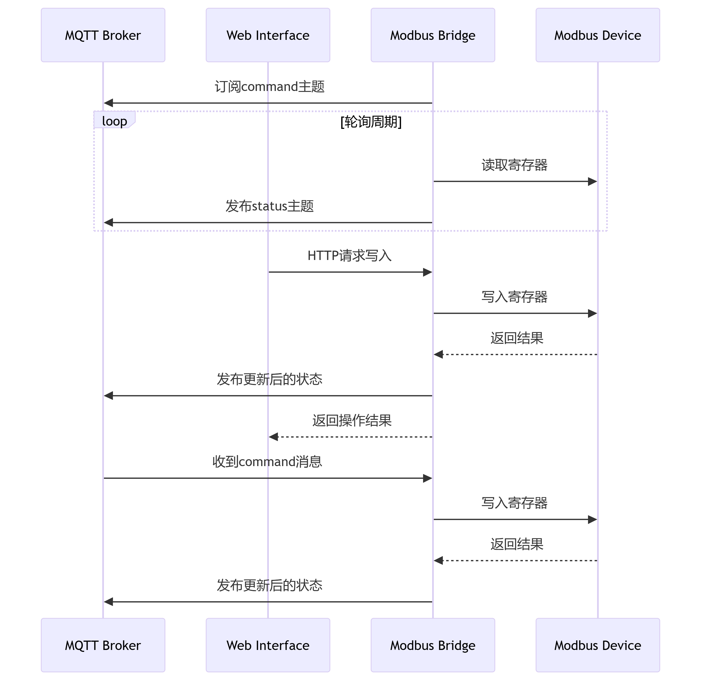

# modbus2mqttBridge
提供modbus/TCP的集中管理能力,并且实现modbus/TCP与mqtt的桥接功能,方便扩展.


[github](https://github.com/liuqwert/modbus2mqttBridge.git "github")


## 时序图
 {: width="600px"}

## 运行说明

### 安装依赖

```
pip install -r requirements.txt
```

## 启动服务


```
python main.py
```
### 访问Web界面

http://localhost:5000


## MQTT测试

#### 订阅状态
```
mosquitto_sub -t "modbus/telemetry/#"
```

#### 发送控制命令
```
mosquitto_pub -t "modbus/command/PLC_MAIN/1" -m '{"address":40001, "value":123}'
```

### 此项目完整实现了以下功能：

1.多Modbus主站/从站管理

2.定时数据采集与MQTT发布

3.MQTT指令订阅与寄存器写入

4.实时Web监控界面

5.写入后立即验证与状态更新
